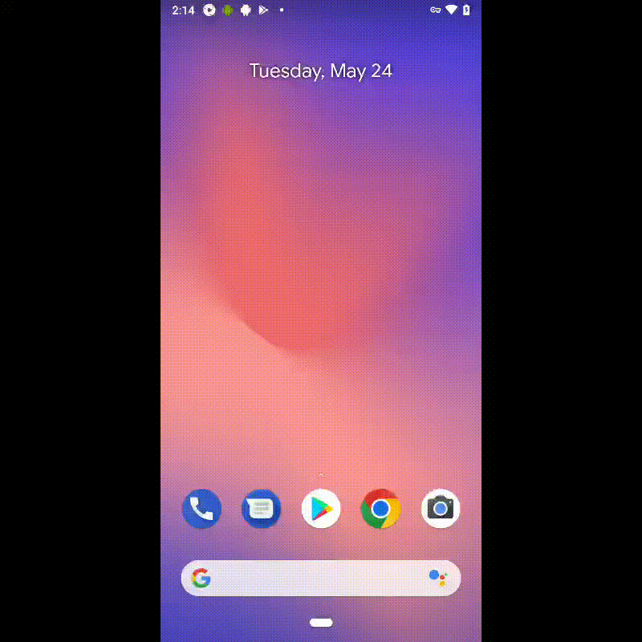
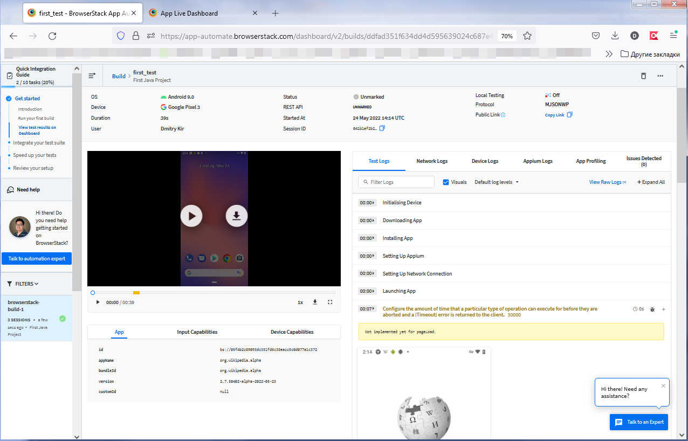

# Automation Tests (mobile automation tests with using Browserstack with Appium)

## Technology Stack
| <a href="https://www.jetbrains.com/idea/"></a> |  |  |  |  |  |  |  |  |
|:------------------------------------------------------------------------------------------------------------------:| :---------: |:---------------------------------------------------------------------------------------------------------------------:|:------------------------------------------------------------------------:|:-------------------------------------------------------------------------:|:-------------------------------------------------------------------:|:------------------------------------------------------------------------------------:|:--------------------------------------------------------------------------:|:---------------------------------------------------------------------------:|
|                                                        IDEA                                                        | Java |                                                          Git                                                          |                                  JUnite                                  |                               Browserstack                                |                               Appium                                |                                     Rest-Assured                                     |                                   Allure                                   |                                   Jenkins                                   |

## 1) Create browserstack account :
##### https://www.browserstack.com/

```bash
get creditionals like:
"browserstack.user"
"browserstack.user"
"app" (url after uploading .apk to browserstack server)
url: "http://hub.browserstack.com/wd/hub"
```

## 2) Tests run:
```bash
src/test/java/tests/AndroidSelenideLastVersionAppWikiTests.java
```


## 3) Examples of builds and runs in the browserstack:



## Common links&notes:
##### https://www.browserstack.com/
##### https://app-automate.browserstack.com/dashboard/v2/getting-started
##### https://app-automate.browserstack.com/dashboard/v2/quick-start/get-started#introduction

```bash
browserstack:
https://www.browserstack.com/
APP LIVE      (develope, debug, manual tests)
APP AUTOMATE  (automation, runs, etc.) 

Appium (Android, iOs)

https://app-automate.browserstack.com/dashboard/v2/getting-started
use "Java"
https://app-automate.browserstack.com/dashboard/v2/quick-start/get-started#introduction
Step3
Configure test script

```


